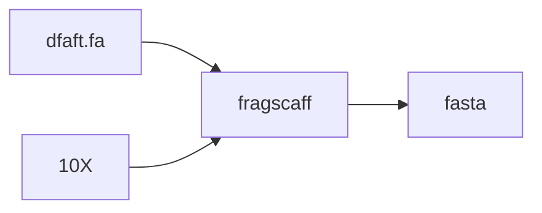
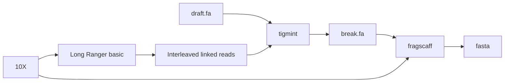
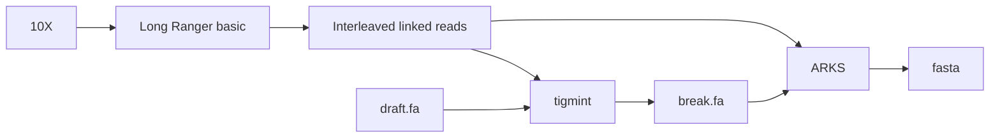
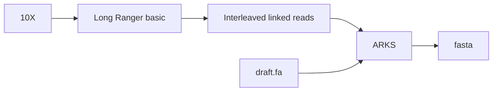

# 软件版本

## fragscaff流程
```
/ifs/TJPROJ3/Plant/Pipeline/10XG/bin/10XGscaff_v2.1
```
## tigmint
[tigmint](https://github.com/bcgsc/tigmint)
```
tigmint --version
Tigmint 1.1.2
```
## ARKS
[ARKS](https://github.com/bcgsc/arks)
```
arks --version
VERSION: arks 1.0.2
```
## LINKS
[LINKS](https://github.com/bcgsc/links)
```
LINKS --version
LINKS [v1.8.6]
```
# 测试数据
## 基因组特征

## 10X数据
62G
```
/ifs/TJPROJ3/Plant/Plant_Assembly/NJ_cop-to_TJ/P101SC17090890-01_danshen_10X/*.fq.gz
```
# 组装方案
## fragscaff


## tigmint+fragscaff


## tigmint+ARKS


## ARKS


# 组装结果
fragscaff,tigmint,ARKS均使用默认参数进行测试
## fragscaff
Scaffolds | withGaps | withoutGaps
-: | -: | -:
Seqs   |                 412 |
Total  |         611,768,841 |         609,144,668
Max    |          10,668,331 |          10,614,412
n50    |           2,414,574 |           2,395,696
n90    |             758,348 |             758,348

Contigs | withNs | withoutNs
-: | -: | -:
Seqs   |                 844 |
Total  |         609,144,668 |         609,144,668
Max    |           4,134,085 |           4,134,085
n50    |           1,045,551 |           1,045,551
n90    |             392,397 |             392,397

| | Gaps
-: | -: 
Seqs   |                 432 |
Total  |           2,624,173
Max    |               7,973
n50    |               6,489
n90    |               4,500

Non-gapped Ns Count:  0

----------------------------------------
## tigmint+fragscaff
Scaffolds | withGaps | withoutGaps
-: | -: | -:
Seqs   |                 418 |
Total  |         611,799,396 |         609,144,644
Max    |          10,668,328 |          10,614,412
n50    |           2,413,918 |           2,395,696
n90    |             758,567 |             758,348

Contigs | withNs | withoutNs
-: | -: | -:
Seqs   |                 851 |
Total  |         609,144,644 |         609,144,644
Max    |           4,134,085 |           4,134,085
n50    |           1,045,551 |           1,045,551
n90    |             392,397 |             392,397

| | Gaps
-: | -: 
Seqs   |                 433 |
Total  |           2,654,752
Max    |               7,974
n50    |               6,571
n90    |               4,500

Non-gapped Ns Count:  0 

----------------------------------------
## tigmint+ARKS
Scaffolds | withGaps | withoutGaps
-: | -: | -:
Seqs   |                 654 |
Total  |         609,164,468 |         609,144,668
Max    |           6,483,884 |           6,483,684
n50    |           1,455,412 |           1,455,312
n90    |             516,064 |             516,064

Contigs | withNs | withoutNs
-: | -: | -:
Seqs   |                 852 |
Total  |         609,144,668 |         609,144,668
Max    |           4,134,085 |           4,134,085
n50    |           1,045,551 |           1,045,551
n90    |             392,397 |             392,397

| | Gaps
-: | -: 
Seqs   |                 198 |
Total  |              19,800
Max    |                 100
n50    |                 100
n90    |                 100

Non-gapped Ns Count:  0 

----------------------------------------
## ARKS
Scaffolds | withGaps | withoutGaps
-: | -: | -:
Seqs   |                646 |
Total  |        609,164,468 |        609,144,668
Max    |          6,483,884 |          6,483,684
n50    |          1,455,412 |          1,455,312
n90    |            516,064 |            516,064

Contigs | withNs | withoutNs
-: | -: | -:
Seqs   |                844 |
Total  |        609,144,668 |        609,144,668
Max    |          4,134,085 |          4,134,085
n50    |          1,045,551 |          1,045,551
n90    |            392,397 |            392,397

| | Gaps
-: | -: 
Seqs   |                198 |
Total  |             19,800
Max    |                100
n50    |                100
n90    |                100

Non-gapped Ns Count:  0 

----------------------------------------
# 评估分析
根据tigmint的算法,将10X的linked reads数据分组成molecules,molecules覆盖度少的区域是潜在的错误组装.
通过breakpoint的数量来评价无参基因组装的质量.
### 10X
| 组装方案  | breakpoint |
| - | - | 
| fragscaff | 10 |
| tigmint+fragscaff | 6 |
| tigmint+ARKS | 0 |
| ARKS | 8 |
| origin | 8 |
### Hi-C
| 组装方案  | input_breaks | breakpoints_iteration_2 | breakpoints_iteration_3 | breakpoints_iteration_4 | breakpoints_iteration_5 |
| - | - | - | - | - | - |
| fragscaff | 84 | 323 | 112 | 72 | 41 | 1r
| tigmint+fragscaff | 88 | 325 | 106 | 52 | 41 | 1r
| tigmint+ARKS | 65 | 455 | 125 | 85 | 105 | √
| ARKS | 65 | 453 |169 | 83 | 78 | 1r
| origin | 50 | 600 | 225 | 88 | 47 | √
## 统计breakpoint
### 10X

``` shell
segment=$(awk '{print $4}' draft.tigmint.fa.bed | grep '-' | wc -l)
line=$(awk '{print $4}' draft.tigmint.fa.bed | grep '-' | grep -f - draft.tigmint.fa.bed | awk  '{print $1}' | uniq | wc -l)
expr $segment - $line
```
### Hi-C
根据输出的input_breaks和breakpoints_iteration_*.txt来计算misassemblies
``` shell
wc input_breaks breakpoints_iteration_*.txt | awk '{print $2 - $1}'
```